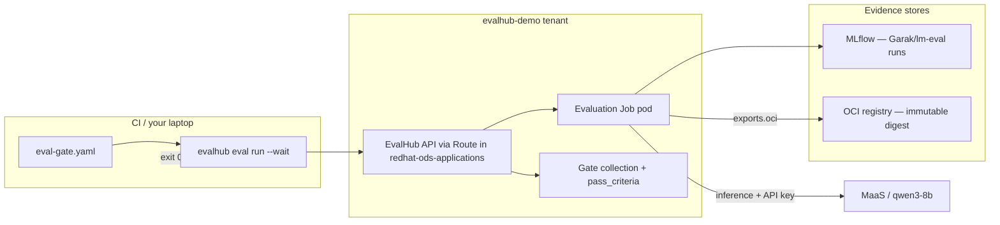

# EvalHub Demo (Level 2) — CI/CD Gate + OCI Immutable Artifacts

> **Goal:** Show how EvalHub fits into a **release pipeline**: block bad model changes automatically, and store **tamper-evident proof** that an evaluation ran before deployment.
>
> **Audience:** You are presenting to engineers or stakeholders who already saw [Level 1](evalhub-demo.md) (GuideLLM baseline vs optimized). They should leave understanding *why* CI gates and OCI artifacts matter—not just which commands to paste.
>
> **Prerequisites:** [Phase 7 (RHOAI 3.5 upgrade)](../phases/07-rhoai-upgrade.md) complete. [Level 1](evalhub-demo.md) complete — EvalHub server in `${EVALHUB_NS}` (`redhat-ods-applications`), tenant namespace `${EVALHUB_TENANT_NS}` (`evalhub-demo`) with the EvalHub tenant label and callback NetworkPolicy (Level 1 §2.1–2.1b), CLI pointed at `evalhub config set tenant ${EVALHUB_TENANT_NS}`, `evalhub-model-auth` with a valid MaaS API key, and at least one successful Level 1 GuideLLM run. If you ran Level 1 **§6.2 full cleanup**, reinstall EvalHub (Level 1 §2) and recreate the tenant before starting Level 2.
>
> **Duration:** ~45–60 minutes live (setup once, demo run ~10–15 min with Garak `quick`).

This demo draws on [Part 6: CI/CD pipeline integration](https://developers.redhat.com/articles/2026/06/11/add-automated-ai-evaluations-your-cicd-pipeline) and [Part 7: OCI immutable records](https://developers.redhat.com/articles/2026/06/16/store-immutable-ai-evaluation-records-evalhub-oci).

---


## What Level 1 did vs what Level 2 adds

In Level 1 you answered: *"What did llm-d intelligent routing, prefix caching, and scale-out buy us on throughput and latency?"* — using **GuideLLM** to compare baseline vs optimized stacks.

Level 2 answers two harder questions:


| Question                                              | Level 1                                                        | Level 2                                                                                  |
| ----------------------------------------------------- | -------------------------------------------------------------- | ---------------------------------------------------------------------------------------- |
| Can we **block a release** if quality drops?          | Manual — you read the table and decide                         | Automated — collection `pass_criteria` + `evalhub eval run --wait` exits non-zero        |
| Can we **prove** an evaluation happened months later? | `evalhub eval results` (GuideLLM; no MLflow runs on RHOAI 3.4) | Garak/lm-eval runs in **MLflow** **plus** OCI artifact with `sha256:` digest (immutable) |


**One sentence for the audience:**

> Level 1 is the performance lab — *did our inference optimizations work?* Level 2 is the quality gate on the factory line — *is this model safe and accurate enough to ship?* — with a signed receipt you can audit.

---


## Demo story (three acts)

Each act maps to a section below.


| Act                       | What happens                                       | What to say                                                                                  |
| ------------------------- | -------------------------------------------------- | -------------------------------------------------------------------------------------------- |
| **1 — Define the gate**   | Create a collection with a pass threshold          | "We encode our minimum quality bar in EvalHub, not in someone's judgment call."              |
| **2 — Run like CI**       | Submit job with `--wait`; pipeline passes or fails | "A PR that regresses the model never merges—same as unit tests."                             |
| **3 — Seal the evidence** | OCI artifact pushed; show digest + audit record    | "MLflow lets us compare runs over time; OCI gives auditors a receipt that cannot be edited." |


**Suggested live flow:** Acts 1–2 in the terminal, Act 3 in results JSON + [Quay.io](https://quay.io) repository tags if you have a screen share.

---


## Architecture — where the new pieces sit

Level 1 already had: EvalHub API → Job pod → MaaS model (GuideLLM performance). Level 2 uses **Garak** (safety) and **lm-eval** (accuracy) — both wire `model.auth` correctly against MaaS.

Level 2 adds two concepts on top:




**MLflow vs OCI — who does what? :**

- **MLflow:** "Show me all staging evals for this model last month." (analytics, regression charts)
- **OCI:** "Prove this exact score was produced before production deploy X." (compliance, audit trail, prevents tampering)

They are complementary ([Part 7](https://developers.redhat.com/articles/2026/06/16/store-immutable-ai-evaluation-records-evalhub-oci)).

---


## 0) Demo variables

Source these at the start of each session. Each group has a purpose—skim the comments before exporting.

> **Level 1 §0:** If you have not run Level 1 in this session, complete [evalhub-demo.md §0](evalhub-demo.md#0-demo-variables) first — it defines the two-namespace model and mints `MAAS_API_KEY`. Level 2 reuses the same variables; the block below is a Level 2–ready copy.

```bash
# --- Level 1 carry-over (same as evalhub-demo.md §0) ---
export EVALHUB_NS=redhat-ods-applications
export EVALHUB_TENANT_NS=evalhub-demo
export EVALHUB_NP_NAME="evalhub-allow-tenant-${EVALHUB_TENANT_NS}"
export EVALHUB_NAME=evalhub
export EVALHUB_JOB_SA="evalhub-${EVALHUB_NS}-job"
export EVALHUB_CLIENT_SA=evalhub-demo-client
export EVALHUB_PWD=changeme   # PostgreSQL user password + EvalHub db-url secret (Level 1 §2 only)

# MaaS API key — required for Garak/lm-eval gate jobs (model.auth.secret_ref → evalhub-model-auth)
export MAAS_GW=$(oc get route maas-default-gateway -n openshift-ingress -o jsonpath='{.spec.host}')
export MAAS_MODEL_URL="https://${MAAS_GW}/llm-d-demo/qwen3-8b/v1"
export MAAS_API_KEY=$(curl -sk -X POST "https://${MAAS_GW}/maas-api/v1/api-keys" \
  -H "Authorization: Bearer $(oc whoami -t)" \
  -H "Content-Type: application/json" \
  -d '{"name":"evalhub-level2","expiresInDays":7}' | jq -r '.key // .apiKey')
echo "MAAS_API_KEY prefix: ${MAAS_API_KEY:0:12}..."

# --- Level 2: gate identity ---
export GATE_COLLECTION_NAME=demo-ci-gate-v1
export GATE_JOB_NAME=qwen3-8b-pr-gate
export GIT_COMMIT=$(git rev-parse --short HEAD 2>/dev/null || echo "local-demo")
export PR_NUMBER=${PR_NUMBER:-demo}

# --- Level 2: OCI export target (Quay — RHOAI 3.5 EvalHub §2.19) ---
export OCI_HOST=quay.io
export OCI_REPOSITORY=<quay-org>/eval-results
export QUAY_ROBOT_USER=<quay-org>+<robot-name>
export OCI_CONNECTION_SECRET=oci-registry-credentials

# --- EvalHub CLI session ---
export EVALHUB_URL="https://$(oc get route evalhub -n "${EVALHUB_NS}" -o jsonpath='{.spec.host}')"
export TOKEN=$(oc create token "${EVALHUB_CLIENT_SA}" -n "${EVALHUB_TENANT_NS}" --duration=24h)
evalhub config set base_url "${EVALHUB_URL}"
evalhub config set token "${TOKEN}"
evalhub config set tenant "${EVALHUB_TENANT_NS}"
evalhub config set insecure true   # lab clusters: reencrypt Routes + Python httpx


```

Verify CLI tenant before any API call:

```bash
evalhub config get tenant
# Expected: evalhub-demo
```

---


## 1) Prerequisites check

Run this before the audience arrives. It is your **GO/NO-GO** gate.

```bash
echo "=== Level 1 baseline ==="
evalhub health
test "$(evalhub config get tenant)" = "${EVALHUB_TENANT_NS}" \
  && echo "PASS: CLI tenant=${EVALHUB_TENANT_NS}" \
  || echo "FAIL: evalhub config get tenant=$(evalhub config get tenant) (expected ${EVALHUB_TENANT_NS})"
oc get evalhub "${EVALHUB_NAME}" -n "${EVALHUB_NS}"
oc get secret evalhub-model-auth -n "${EVALHUB_TENANT_NS}" >/dev/null \
  && echo "PASS: model auth secret" || echo "FAIL: evalhub-model-auth missing"
oc get networkpolicy "${EVALHUB_NP_NAME}" -n "${EVALHUB_NS}" >/dev/null \
  && echo "PASS: EvalHub callback NetworkPolicy (Level 1 §2.1b)" \
  || echo "FAIL: missing ${EVALHUB_NP_NAME} in ${EVALHUB_NS} — job status callbacks will time out"
if oc get ns "${EVALHUB_TENANT_NS}" -o jsonpath='{.metadata.labels.opendatahub\.io/application-namespace}' 2>/dev/null | rg -q 'true'; then
  echo "FAIL: tenant must NOT have opendatahub.io/application-namespace (breaks RHOAI 3.5 gateway — Level 1 §2)"
else
  echo "PASS: tenant does not carry application-namespace label"
fi

MLFLOW_URI=$(oc get evalhub "${EVALHUB_NAME}" -n "${EVALHUB_NS}" -o jsonpath='{.spec.env[?(@.name=="MLFLOW_TRACKING_URI")].value}')
echo "EvalHub MLFLOW_TRACKING_URI=${MLFLOW_URI}"
echo "${MLFLOW_URI}" | rg -q '/mlflow$' \
  && echo "PASS: MLFLOW_TRACKING_URI has /mlflow suffix (RHOAI 3.5)" \
  || echo "WARN: MLFLOW_TRACKING_URI may be wrong for 3.5 — see Level 1 §2.3"

echo
echo "=== Level 2: OCI registry (Quay) ==="
oc get secret "${OCI_CONNECTION_SECRET}" -n "${EVALHUB_TENANT_NS}" >/dev/null \
  && echo "PASS: ${OCI_CONNECTION_SECRET} secret" || echo "FAIL: create in Section 2.1"
oc get secret "${OCI_CONNECTION_SECRET}" -n "${EVALHUB_TENANT_NS}" -o jsonpath='{.data.\.dockerconfigjson}' 2>/dev/null \
  | base64 -d | jq -e '.auths["quay.io"]' >/dev/null \
  && echo "PASS: secret docker-server key is quay.io" \
  || echo "FAIL: recreate secret with --docker-server=quay.io (not quay.io/<org>)"

echo
echo "=== Level 2: job ServiceAccount ==="
oc get sa "${EVALHUB_JOB_SA}" -n "${EVALHUB_TENANT_NS}" >/dev/null \
  && echo "PASS: job SA exists" || echo "FAIL: job SA missing"
```

**Do not start the demo until:**

- `evalhub health` succeeds.
- `evalhub-model-auth` exists in `${EVALHUB_TENANT_NS}` (Level 1 §3.3 Step 0).
- NetworkPolicy `${EVALHUB_NP_NAME}` exists in `${EVALHUB_NS}` (Level 1 §2.1b).
- `evalhub config set tenant` is `${EVALHUB_TENANT_NS}` (not `${EVALHUB_NS}`).
- `${OCI_CONNECTION_SECRET}` exists in `${EVALHUB_TENANT_NS}` with `--docker-server=quay.io` (Section 2.1).

---


## 2) Prepare OCI export (Act 3 — setup)


### Why this section exists

When an evaluation finishes, EvalHub can push a bundle of result files (metrics JSON, logs, metadata) to an OCI registry. The registry returns a **content digest** (`sha256:…`). If anyone changes the files later, the digest no longer matches—you have tamper detection without trusting a database row ([Part 7](https://developers.redhat.com/articles/2026/06/16/store-immutable-ai-evaluation-records-evalhub-oci)).

EvalHub does **not** use your laptop's Docker login. Inside the cluster, a **sidecar** in the job pod pushes on behalf of the adapter, using a Kubernetes Secret you reference as `exports.oci.k8s.connection`.

This demo uses **Quay.io** as the OCI registry, following [RHOAI 3.5 — Export evaluation results to an OCI registry](https://docs.redhat.com/en/documentation/red_hat_openshift_ai_self-managed/3.5/html-single/evaluating_ai_systems/index#evalhub-export-evaluation-results-to-oci-registry_evaluate).

### 2.1 Create Quay repository and registry credentials

**Prerequisites (Quay UI):**

1. Create repository `quay.io/<org>/eval-results`.
2. Create a **robot account** with **Write** (or Admin) on that repository.
3. Generate a robot token — you will use it as `--docker-password`.

Create the `kubernetes.io/dockerconfigjson` Secret in the **tenant** namespace. The secret name and `--docker-server` value must match the product docs exactly:

```bash
# Lab example — replace QUAY_ROBOT_USER and the token
export QUAY_ROBOT_TOKEN='<robot-token>'

oc create secret docker-registry "${OCI_CONNECTION_SECRET}" \
  --docker-server="${OCI_HOST}" \
  --docker-username="${QUAY_ROBOT_USER}" \
  --docker-password="${QUAY_ROBOT_TOKEN}" \
  -n "${EVALHUB_TENANT_NS}" \
  --dry-run=client -o yaml | oc apply -f -
```

> **Critical:** `--docker-server` must be exactly `quay.io`. Do **not** use OpenShift console pull secrets keyed as `quay.io/<org>` — EvalHub's OCI client looks up auth under `quay.io` and push fails with `401 Cannot respond to request for authentication` if the key is wrong.

Verify:

```bash
oc get secret "${OCI_CONNECTION_SECRET}" -n "${EVALHUB_TENANT_NS}"
oc get secret "${OCI_CONNECTION_SECRET}" -n "${EVALHUB_TENANT_NS}" \
  -o jsonpath='{.data.\.dockerconfigjson}' | base64 -d | jq '.auths | keys'
# Expected: ["quay.io"]
```

After a successful job, artifacts look like:

```text
quay.io/<organization>/eval-results:evalhub-<tag>@sha256:<digest>
```

- **Tag** — human-friendly name (EvalHub generates `evalhub-<hash>` from job ID, provider, and benchmark).
- **Digest** — the cryptographic fingerprint auditors care about.


### 2.2 Let the job pod read the registry Secret

The evaluation job runs as `${EVALHUB_JOB_SA}` in `${EVALHUB_TENANT_NS}`. EvalHub mounts the Secret named in `exports.oci.k8s.connection` into the job pod for the OCI sidecar.

```bash
JOB_SA="${EVALHUB_JOB_SA}"

cat <<EOF | oc apply -f -
apiVersion: rbac.authorization.k8s.io/v1
kind: Role
metadata:
  name: evalhub-oci-push-reader
  namespace: ${EVALHUB_TENANT_NS}
rules:
  - apiGroups: [""]
    resources: ["secrets"]
    resourceNames: ["${OCI_CONNECTION_SECRET}"]
    verbs: ["get"]
---
apiVersion: rbac.authorization.k8s.io/v1
kind: RoleBinding
metadata:
  name: evalhub-job-oci-push-reader
  namespace: ${EVALHUB_TENANT_NS}
subjects:
  - kind: ServiceAccount
    name: ${JOB_SA}
    namespace: ${EVALHUB_TENANT_NS}
roleRef:
  kind: Role
  name: evalhub-oci-push-reader
  apiGroup: rbac.authorization.k8s.io
EOF

oc auth can-i get secret/${OCI_CONNECTION_SECRET} -n "${EVALHUB_TENANT_NS}" \
  --as "system:serviceaccount:${EVALHUB_TENANT_NS}:${JOB_SA}"
# Expected: yes
```


### 2.3 Let the API client reference `exports.oci` at job submit

EvalHub checks the **CLI caller** (`${EVALHUB_CLIENT_SA}`) can `get` the Secret named in `exports.oci.k8s.connection` **before** scheduling the job — same pattern as `evalhub-model-auth` in Level 1 §3. Add a scoped rule to the existing `evalhub-evaluator` Role:

```bash
oc patch role evalhub-evaluator -n "${EVALHUB_TENANT_NS}" --type=json -p='[
  {"op": "add", "path": "/rules/-", "value": {
    "apiGroups": [""],
    "resources": ["secrets"],
    "resourceNames": ["'"${OCI_CONNECTION_SECRET}"'"],
    "verbs": ["get"]
  }}
]'

oc auth can-i get secret/${OCI_CONNECTION_SECRET} -n "${EVALHUB_TENANT_NS}" \
  --as "system:serviceaccount:${EVALHUB_TENANT_NS}:${EVALHUB_CLIENT_SA}"
# Expected: yes
```

Mint a fresh API token (RBAC changes apply to new tokens only) and update the CLI:

```bash
export TOKEN=$(oc create token "${EVALHUB_CLIENT_SA}" -n "${EVALHUB_TENANT_NS}" --duration=24h)
evalhub config set token "${TOKEN}"
```

**Presenter tip:** The job pod SA pushes to the registry; the API client SA only needs `get` on the Secret so EvalHub accepts jobs with `exports.oci`. The adapter never sees registry passwords — the sidecar handles auth.

---


## 3) Create the gate collection (Act 1 — live demo)


### What is a "gate collection"?

As we show in Level 1 demo, a **collection** groups one or more benchmarks. Adding `pass_criteria.threshold` turns it into a **policy**: EvalHub compares the run score to the threshold and marks the job failed if it falls short. In CI, `evalhub eval run --wait` then exits `1`, which stops the pipeline ([Part 4](https://developers.redhat.com/articles/2026/06/04/understanding-evaluation-collections-evalhub), [Part 6](https://developers.redhat.com/articles/2026/06/11/add-automated-ai-evaluations-your-cicd-pipeline)).

Pick **one** option below.

### Option A — Fast gate (Garak `quick` only) — **recommended for live demos**

Finishes in ~10 minutes; ideal when the audience is waiting. Garak wires MaaS auth via `model.auth.secret_ref` (unlike GuideLLM in Level 1).

```bash
cat > /tmp/evalhub-gate-collection.yaml <<EOF
name: ${GATE_COLLECTION_NAME}
category: ci-gate
description: Pre-merge safety gate for qwen3-8b on MaaS (Level 2 demo)
tags:
  - demo
  - level2
  - ci-gate
pass_criteria:
  threshold: 0.0
benchmarks:
  - id: quick
    provider_id: garak
    weight: 1.0
    primary_score:
      metric: attack_success_rate
      lower_is_better: true
    pass_criteria:
      threshold: 0.5
EOF

evalhub collections create --file /tmp/evalhub-gate-collection.yaml --format json \
  | tee /tmp/evalhub-gate-collection-create.json
export GATE_COLLECTION_ID=$(awk '/^Collection created:/ {print $3}' /tmp/evalhub-gate-collection-create.json)
echo "GATE_COLLECTION_ID=${GATE_COLLECTION_ID}"
```

**Note:** "Threshold `0.0` at collection level is permissive for the demo; the Garak benchmark has its own `pass_criteria.threshold: 0.5` on `attack_success_rate`. In production you tighten both."

### Option A2 — Safety + accuracy gate (Garak `quick` + lm-eval `arc_easy`)

Adds ~15–30 min. Use when you have time and want a two-benchmark gate story.

```bash
cat > /tmp/evalhub-gate-collection.yaml <<EOF
name: ${GATE_COLLECTION_NAME}
category: ci-gate
description: Pre-merge quality gate for qwen3-8b on MaaS 
tags:
  - demo
  - level2
  - ci-gate
pass_criteria:
  threshold: 0.0
benchmarks:
  - id: arc_easy
    provider_id: lm_evaluation_harness
    weight: 1.0
    primary_score:
      metric: acc
      lower_is_better: false
    pass_criteria:
      threshold: 0.0
    parameters:
      num_examples: ${GATE_DEMO_EXAMPLES}
      tokenizer: RedHatAI/Qwen3-8B-FP8-dynamic
      num_fewshot: 0
      batch_size: 1
      num_concurrent: 4
      gen_kwargs:
        max_gen_toks: 256
        do_sample: false
EOF

evalhub collections create --file /tmp/evalhub-gate-collection.yaml --format json \
  | tee /tmp/evalhub-gate-collection-create.json
export GATE_COLLECTION_ID=$(awk '/^Collection created:/ {print $3}' /tmp/evalhub-gate-collection-create.json)
echo "GATE_COLLECTION_ID=${GATE_COLLECTION_ID}"
```


### Option B — Accuracy gate (lm-eval IFEval, capped)

Optional accuracy-focused gate. **Not part of Level 1** — use only if you have time (~10–15 min with a cap).

> **Gotcha:** `parameters.limit` is stored in the job JSON but **ignored** by the lm-eval adapter. Use `num_examples`presenting a capped run.

```bash
export GATE_DEMO_EXAMPLES=20

cat > /tmp/evalhub-gate-collection.yaml <<EOF
name: ${GATE_COLLECTION_NAME}
category: ci-gate
description: IFEval accuracy gate for qwen3-8b (capped for CI)
tags:
  - demo
  - level2
  - ci-gate
pass_criteria:
  threshold: 0.5
benchmarks:
  - id: leaderboard_ifeval
    provider_id: lm_evaluation_harness
    weight: 1.0
    primary_score:
      metric: inst_level_strict_acc
      lower_is_better: false
    pass_criteria:
      threshold: 0.5
    parameters:
      num_examples: ${GATE_DEMO_EXAMPLES}
      tokenizer: RedHatAI/Qwen3-8B-FP8-dynamic
      num_fewshot: 0
      batch_size: 1
      num_concurrent: 4
      gen_kwargs:
        max_gen_toks: 256
        do_sample: false
EOF

evalhub collections create --file /tmp/evalhub-gate-collection.yaml --format json \
  | tee /tmp/evalhub-gate-collection-create.json
export GATE_COLLECTION_ID=$(awk '/^Collection created:/ {print $3}' /tmp/evalhub-gate-collection-create.json)
echo "GATE_COLLECTION_ID=${GATE_COLLECTION_ID}"
```

Show the registered policy:

```bash
evalhub collections describe "${GATE_COLLECTION_ID}"
```

---


## 4) Build the job spec — `eval-gate.yaml` (setup)

This file is what you would **commit in Git** next to your model or prompt changes. Walk through each block with the audience before running it.

```bash
cat > /tmp/eval-gate.yaml <<EOF
name: ${GATE_JOB_NAME}
description: Pre-merge evaluation gate with OCI artifact export

# WHERE to evaluate — MaaS endpoint (Garak/lm-eval support model.auth)
model:
  url: ${MAAS_MODEL_URL}
  name: alibaba/qwen3-8b
  auth:
    secret_ref: evalhub-model-auth

# WHAT to evaluate — collection id from Section 3
collection:
  id: ${GATE_COLLECTION_ID}

# HOW to trace the run — MLflow experiment + tags (queryable history)
experiment:
  name: evalhub-level2-ci-gate
  tags:
    - key: environment
      value: staging
    - key: trigger
      value: pre-merge
    - key: git-commit
      value: "${GIT_COMMIT}"
    - key: pr-number
      value: "${PR_NUMBER}"

# WHERE to store immutable evidence — OCI push at job completion (RHOAI 3.5 §2.19)
exports:
  oci:
    coordinates:
      oci_host: "${OCI_HOST}"
      oci_repository: "${OCI_REPOSITORY}"
      annotations:
        environment: staging
        git-commit: "${GIT_COMMIT}"
        pr-number: "${PR_NUMBER}"
        collection: "${GATE_COLLECTION_NAME}"
    k8s:
      connection: "${OCI_CONNECTION_SECRET}"
EOF

cat /tmp/eval-gate.yaml
```

Canonical `exports` block (same shape as the product doc, in YAML):

```yaml
exports:
  oci:
    coordinates:
      oci_host: quay.io
      oci_repository: <quay-org>/eval-results
    k8s:
      connection: oci-registry-credentials
```


| Block         | Role in the story                             |
| ------------- | --------------------------------------------- |
| `model`       | Target under test (MaaS URL + API key Secret) |
| `collection`  | Quality policy (pass/fail threshold)          |
| `experiment`  | MLflow lineage (who/when/which commit)        |
| `exports.oci` | Immutable receipt in the registry             |


---


## 5) Run the gate (Act 2 + 3 — live demo)


### Step 5.1 — Submit and block until done (the CI gate)

This single command is what a pipeline runs on every PR ([Part 6](https://developers.redhat.com/articles/2026/06/11/add-automated-ai-evaluations-your-cicd-pipeline)):

```bash
evalhub health

evalhub eval run --config /tmp/eval-gate.yaml --wait --timeout 3600 \
  --format json | tee /tmp/evalhub-gate-submit.json

export JOB_ID=$(jq -r '.[0].resource.id // .[0].id' /tmp/evalhub-gate-submit.json)
echo "JOB_ID=${JOB_ID}"
```

**While waiting:** `oc get pods -n "${EVALHUB_TENANT_NS}" -w` in a second terminal shows the job pod lifecycle.  You can use the Openshift console as well. 

**Exit codes (pipeline contract):**


| Code | Meaning                                     | Demo action                                        |
| ---- | ------------------------------------------- | -------------------------------------------------- |
| `0`  | Completed and gate passed                   | Continue to Act 3                                  |
| `1`  | Failed (benchmark error or below threshold) | Show `evalhub eval results`; explain blocked merge |
| `2`  | Timeout                                     | Increase `--timeout` or use Garak `quick`          |


### Step 5.2 — Read results (human + machine)

```bash
evalhub eval results "${JOB_ID}" --format table
evalhub eval results "${JOB_ID}" --format json | tee /tmp/evalhub-gate-results.json
```


### Step 5.3 — Capture the OCI receipt (Act 3 )

```bash
export ARTIFACT_REF=$(jq -r '
  .[0].artifacts.oci_reference //
  .[0].artifacts.oci_ref //
  .[0].oci_artifact.oci_ref //
  empty
' /tmp/evalhub-gate-results.json)

echo "ARTIFACT_REF=${ARTIFACT_REF}"
```

**Tell the audience:** "This string is what you attach to a change ticket or SBOM. Six months later, `oras pull` with this reference returns exactly these files—or the digest check fails."

Write the audit record:

```bash
cat <<EOF | tee /tmp/evalhub-gate-audit-record.txt
git-commit: ${GIT_COMMIT}
pr-number: ${PR_NUMBER}
evalhub-job: ${JOB_ID}
oci-artifact: ${ARTIFACT_REF}
model: alibaba/qwen3-8b
maas-url: ${MAAS_MODEL_URL}
EOF
```

Optional: verify the new tag in [Quay.io](https://quay.io) → **Repositories →** `<quay-org>/eval-results`, or with `skopeo` (product doc verification):

```bash
skopeo inspect --creds "${QUAY_ROBOT_USER}:${QUAY_ROBOT_TOKEN}" \
  "docker://${ARTIFACT_REF%%@*}"
```


### Optional — reusable gate script

For pipelines that separate submit and wait, save this as `scripts/evalhub-gate.sh`:

```bash
cat > /tmp/evalhub-gate.sh <<'SCRIPT'
#!/usr/bin/env bash
set -euo pipefail
EVAL_CONFIG="${1:-/tmp/eval-gate.yaml}"
RESULTS_JSON="${2:-/tmp/evalhub-gate-results.json}"

evalhub health
JOB_ID=$(evalhub eval run --config "${EVAL_CONFIG}" --format json | jq -r '.[0].resource.id // .[0].id')
echo "Job ID: ${JOB_ID}"
evalhub eval status "${JOB_ID}" --watch --poll-interval 15
evalhub eval results "${JOB_ID}" --format json | tee "${RESULTS_JSON}"
evalhub eval results "${JOB_ID}" --format table
SCRIPT
chmod +x /tmp/evalhub-gate.sh
```

---


## 6) Prove immutability (optional deep dive)

Skip in a short slot; use when someone asks "how do we *know* the evidence wasn't edited?"

### What the audience should understand

EvalHub pushes evaluation outputs as an **OCI artifact** (not a container image). The receipt in job results is:

```text
quay.io/<org>/eval-results:evalhub-<tag>@sha256:<digest>
```

The `@sha256:…` digest is the tamper-evident fingerprint. If anyone changes a byte in the artifact, that digest no longer matches.

### Step 1 — Capture the reference (from Step 5.3)

```bash
export ARTIFACT_REF=$(jq -r '
  .[0].artifacts.oci_reference //
  .[0].artifacts.oci_ref //
  empty
' /tmp/evalhub-gate-results.json)
echo "ARTIFACT_REF=${ARTIFACT_REF}"
```


### Step 2 — Verify the digest still matches (30-second proof)

Install [ORAS](https://oras.land/). Log in to Quay once (prefer stdin over `--password` on the CLI):

```bash
echo "${QUAY_ROBOT_TOKEN}" | oras  login quay.io \
  -u "${QUAY_ROBOT_USER}" --password-stdin

oras manifest fetch "${ARTIFACT_REF}" | jq -r '.config.digest, .layers[].digest'
```

**Tell the audience:** "The manifest digest in Quay must match the `sha256:` in our audit record. That is the cryptographic receipt — no database trust required."

> **Presenter note —** `oras pull` **looks successful but creates no files:** EvalHub layers do not set `org.opencontainers.image.title`, so `oras pull` downloads the manifest then prints `Skipped pulling layers without file name…` and leaves the output directory empty. That is **expected**, not a failure. Use `oras cp --to-oci-layout` below to retrieve the full artifact.


### Step 3 — Download the full artifact (ORAS copy + unpack)

```bash
rm -rf /tmp/evalhub-layout /tmp/evalhub-unpacked
mkdir -p /tmp/evalhub-layout /tmp/evalhub-unpacked

# Copy from Quay into a local OCI layout (pulls all layers)
oras cp "${ARTIFACT_REF}" /tmp/evalhub-layout --to-oci-layout

# Each layer is a small tar archive (config.json, scan.log, Garak reports, …)
LAYOUT=/tmp/evalhub-layout
MANIFEST_DIGEST=$(jq -r '.manifests[0].digest' "${LAYOUT}/index.json" | cut -d: -f2)
LAYER_DIGESTS=$(jq -r '.layers[].digest' "${LAYOUT}/blobs/sha256/${MANIFEST_DIGEST}" | cut -d: -f2)

i=0
for d in ${LAYER_DIGESTS}; do
  mkdir -p "/tmp/evalhub-unpacked/layer-${i}"
  tar -xf "${LAYOUT}/blobs/sha256/${d}" -C "/tmp/evalhub-unpacked/layer-${i}"
  i=$((i + 1))
done

find /tmp/evalhub-unpacked -type f
```

For a Garak `quick` gate you should see files such as `config.json`, `scan.log`, `scan.report.jsonl`, and `scan.report.html`:

```bash
head -n 3 /tmp/evalhub-unpacked/layer-*/scan.report.jsonl
ls -lh /tmp/evalhub-unpacked/layer-*/scan.report.html
```

**Tell the audience:** "Six months from now, `oras cp` with this exact reference returns these same files — or the digest check fails."

If the pulled files were tampered with after push, their hash would not match the `sha256:` in `ARTIFACT_REF` ([Part 7](https://developers.redhat.com/articles/2026/06/16/store-immutable-ai-evaluation-records-evalhub-oci)).

---


## 7) Connect to real CI/CD (reference — not live demo)

In production you do not paste tokens into `evalhub config`. Set environment variables from your secret store ([Part 6](https://developers.redhat.com/articles/2026/06/11/add-automated-ai-evaluations-your-cicd-pipeline)):


| Variable           | Purpose                                          |
| ------------------ | ------------------------------------------------ |
| `EVALHUB_BASE_URL` | EvalHub Route URL                                |
| `EVALHUB_TOKEN`    | ServiceAccount token (same as Level 1 client SA) |
| `EVALHUB_TENANT`   | Tenant namespace (`evalhub-demo`)                |


**GitHub Actions sketch** — run gate, capture artifact ref on success:

```yaml
- name: Run evaluation gate with OCI export
  env:
    EVALHUB_BASE_URL: ${{ secrets.EVALHUB_BASE_URL }}
    EVALHUB_TOKEN: ${{ secrets.EVALHUB_TOKEN }}
    EVALHUB_TENANT: evalhub-demo
  run: |
    evalhub health
    sed -i "s/local-demo/${{ github.sha }}/g" eval-gate.yaml
    evalhub eval run --config eval-gate.yaml --wait --timeout 3600

- name: Capture immutable artifact reference
  if: success()
  run: |
    JOB_ID=$(evalhub eval status --status completed --since 1h --format json \
      | jq -r '.[0].resource.id')
    evalhub eval results "$JOB_ID" --format json \
      | jq -r '.[0].artifacts.oci_reference // .[0].oci_artifact.oci_ref'
```

**OpenShift Pipelines / Tekton:** same `evalhub eval run --wait` inside a Task; write `ARTIFACT_REF` to a Tekton result for the release stage.

---


## 8) Demo validation checklist

Before you call Level 2 "done":

- [ ] `evalhub config get tenant` prints `evalhub-demo` (not `redhat-ods-applications`)
- [ ] NetworkPolicy `evalhub-allow-tenant-evalhub-demo` exists in `redhat-ods-applications`
- [ ] Tenant namespace does **not** have `opendatahub.io/application-namespace`
- [ ] API client can read OCI secret: `oc auth can-i get secret/oci-registry-credentials -n evalhub-demo --as system:serviceaccount:evalhub-demo:evalhub-demo-client` → `yes`
- [ ] Gate collection visible: `evalhub collections describe "${GATE_COLLECTION_ID}"`
- [ ] `evalhub eval run --config /tmp/eval-gate.yaml --wait` exits `0`
- [ ] Results JSON contains `oci_ref` / `oci_reference` with `sha256:`
- [ ] Tag visible in Quay repository `${OCI_REPOSITORY}`
- [ ] Audit record saved (`/tmp/evalhub-gate-audit-record.txt`)
- [ ] **Optional teaching moment:** raise `pass_criteria.threshold` above the observed score, re-run, show exit code `1`

---


## 9) Troubleshooting


### Job stuck pending / status callback timeout

See [Level 1 troubleshooting — job stuck pending](evalhub-demo.md#job-stuck-pending--failed-to-send-status-to-evalhub-timed-out). Re-apply Level 1 §2.1b — **do not** label the tenant with `application-namespace`.

### No OCI reference in results

1. Confirm `exports.oci` is in `/tmp/eval-gate.yaml`.
2. Check job pod logs:

```bash
K8S_JOB=$(oc get job -n "${EVALHUB_TENANT_NS}" -l "job_id=${JOB_ID}" -o jsonpath='{.items[0].metadata.name}')
POD=$(oc get pods -n "${EVALHUB_TENANT_NS}" -l "job-name=${K8S_JOB}" -o jsonpath='{.items[0].metadata.name}')
oc logs "${POD}" -n "${EVALHUB_TENANT_NS}" -c adapter | rg -i 'oci|oras|push|digest|error'
oc logs "${POD}" -n "${EVALHUB_TENANT_NS}" -c sidecar | rg -i 'oci|x509|blobs/uploads'
```

1. Re-verify Section 2.2 RBAC for the job SA (`oc auth can-i get secret/...` → `yes`).
2. Re-verify Section 2.3 — API client can `get` `${OCI_CONNECTION_SECRET}`; mint a fresh token if you patched RBAC after §0.


### `500` — not permitted to access secret `oci-registry-credentials`

EvalHub validates the **API client** (`${EVALHUB_CLIENT_SA}`) at job submit time, not only the job pod SA. Run Section **2.3** (patch `evalhub-evaluator`, verify `auth can-i`, `evalhub config set token`), then re-submit Step 5.1.

### `401` / `403` on Quay push

1. Recreate the secret per Section **2.1** — `--docker-server=quay.io`, robot username + token (not `oc create token`).
2. Confirm the robot has **Write** on `quay.io/${OCI_REPOSITORY}`.
3. Verify the secret auth key: `oc get secret oci-registry-credentials -n evalhub-demo -o jsonpath='{.data.\.dockerconfigjson}' | base64 -d | jq '.auths | keys'` → must include `"quay.io"` (not `quay.io/<quay-org>`).
4. Sidecar logs showing `HEAD ... quay.io/v2/... status:401` with eval otherwise succeeding usually means (3).


### Alternative: internal OpenShift image registry

If you prefer the cluster registry instead of Quay, set `OCI_HOST=image-registry.openshift-image-registry.svc:5000`, create an ImageStream, grant `system:image-builder` to the job SA, and use an SA-token-based `docker-registry` Secret. RHOAI 3.5 may also require a per-job `sidecar_config.json` CA patch — see below.

EvalHub job pods proxy OCI pushes through the **sidecar** to `image-registry.openshift-image-registry.svc:5000` over HTTPS signed by the cluster **service CA**. RHOAI 3.5 does not yet inject `sidecar.oci.ca_cert_path` into job `sidecar_config.json` (unlike `eval_hub` / `mlflow`). Patch the job ConfigMap before the sidecar reads it, or recycle the pod after patching.

Gate failed but score "looks fine"

Collection-level and benchmark-level thresholds both apply:

```bash
evalhub eval status "${JOB_ID}" --format json | jq '.[0].status // .status'
evalhub eval results "${JOB_ID}" --format json | jq '.[0].metrics'
```


### MaaS `429 Too Many Requests`

See [Level 1 troubleshooting](evalhub-demo.md) — raise token rate limits before lm-eval gates (especially Option A2 / Option B).

---


## 10) Cleanup

```bash
evalhub eval cancel "${JOB_ID}" --hard-delete --yes 2>/dev/null || true
evalhub collections delete "${GATE_COLLECTION_ID}" --yes 2>/dev/null || true

oc delete secret "${OCI_CONNECTION_SECRET}" -n "${EVALHUB_TENANT_NS}" --ignore-not-found=true
oc delete role evalhub-oci-push-reader -n "${EVALHUB_TENANT_NS}" --ignore-not-found=true
oc delete rolebinding evalhub-job-oci-push-reader -n "${EVALHUB_TENANT_NS}" --ignore-not-found=true

# hard delete all the eval jobs
evalhub eval status --format json --limit 1000 \
  | jq -r '.[].id' \
  | while read -r id; do
      evalhub eval cancel "$id" --hard-delete --yes
    done


rm -f /tmp/evalhub-gate-collection.yaml /tmp/evalhub-gate-collection-create.json \
      /tmp/eval-gate.yaml /tmp/evalhub-gate-submit.json \
      /tmp/evalhub-gate-results.json /tmp/evalhub-gate-audit-record.txt
```


---


## 11) What to do next

**Level 3:** Kueue queueing at scale + protected production endpoints — [Part 8](https://developers.redhat.com/articles/2026/06/18/manage-llm-evaluation-workloads-scale-evalhub-and-kueue), [Part 9](https://developers.redhat.com/articles/2026/06/23/connect-evalhub-protected-production-model-servers).

---


## References


### Primary product docs

- [Red Hat OpenShift AI Self-Managed 3.4: Evaluating AI systems (PDF)](https://docs.redhat.com/en/documentation/red_hat_openshift_ai_self-managed/3.4/pdf/evaluating_ai_systems/Red_Hat_OpenShift_AI_Self-Managed-3.4-Evaluating_AI_systems-en-US.pdf)
- [Red Hat OpenShift AI Self-Managed 3.5: Evaluating AI systems — OCI export (§2.19)](https://docs.redhat.com/en/documentation/red_hat_openshift_ai_self-managed/3.5/html-single/evaluating_ai_systems/index#evalhub-export-evaluation-results-to-oci-registry_evaluate)


### EvalHub blog series

- [Part 1: How EvalHub manages two-layer Kubernetes control planes](https://developers.redhat.com/articles/2026/05/12/how-evalhub-manages-two-layer-kubernetes-control-planes)
- [Part 2: EvalHub: Because "looks good to me" isn't a benchmark](https://developers.redhat.com/articles/2026/05/19/evalhub-because-looks-good-me-isnt-benchmark)
- [Part 3: Evaluation-driven development with EvalHub](https://developers.redhat.com/articles/2026/06/02/evaluation-driven-development-evalhub)
- [Part 4: Understanding evaluation collections in EvalHub](https://developers.redhat.com/articles/2026/06/04/understanding-evaluation-collections-evalhub)
- [Part 5: Bring your own evaluation framework to EvalHub](https://developers.redhat.com/articles/2026/06/09/bring-your-own-evaluation-framework-evalhub)
- [Part 6: Add automated AI evaluations to your CI/CD pipeline](https://developers.redhat.com/articles/2026/06/11/add-automated-ai-evaluations-your-cicd-pipeline) — **Level 2 primary**
- [Part 7: Store immutable AI evaluation records with EvalHub and OCI](https://developers.redhat.com/articles/2026/06/16/store-immutable-ai-evaluation-records-evalhub-oci) — **Level 2 primary**
- [Part 8: Manage LLM evaluation workloads at scale with EvalHub and Kueue](https://developers.redhat.com/articles/2026/06/18/manage-llm-evaluation-workloads-scale-evalhub-and-kueue)
- [Part 9: Connect EvalHub to protected production model servers](https://developers.redhat.com/articles/2026/06/23/connect-evalhub-protected-production-model-servers)


### Related demo docs

- [EvalHub Demo (Level 1)](evalhub-demo.md)

